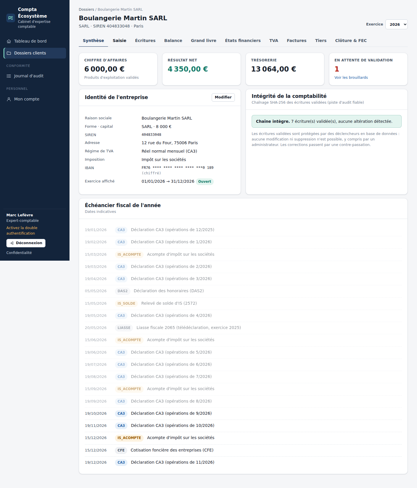
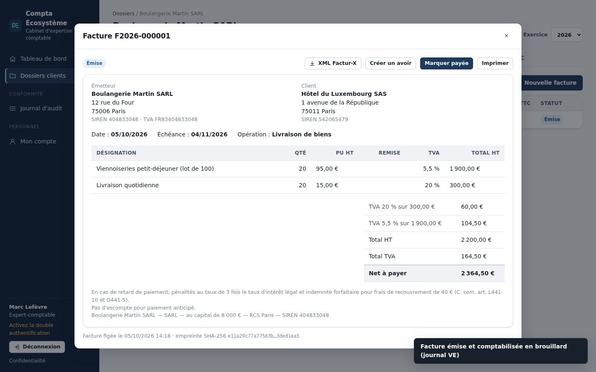
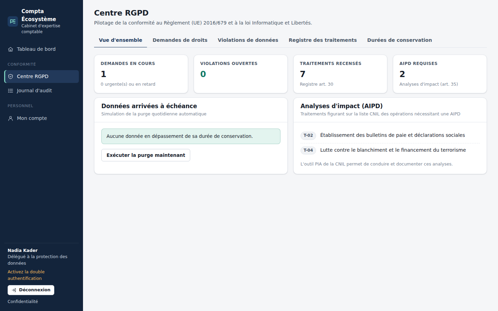

# Compta Écosystème

**Plateforme logicielle pour cabinets d'expertise comptable, conforme par conception au droit comptable et fiscal français et au RGPD.**

Comptabilité en partie double aux écritures intangibles, FEC conforme, TVA, facturation prête pour la réforme de la facturation électronique 2026, et centre de conformité RGPD complet : registre, droits des personnes, violations de données, purge automatique.



---

## Sommaire

- [Fonctionnalités](#fonctionnalités)
- [Démarrage rapide](#démarrage-rapide)
- [Architecture](#architecture)
- [Conformité](#conformité)
- [Sécurité](#sécurité)
- [Tests](#tests)
- [Déploiement](#déploiement)
- [Limites et feuille de route](#limites-et-feuille-de-route)

## Fonctionnalités

### Comptabilité générale
| | |
|---|---|
| **Plan comptable** | PCG (règlement ANC n° 2014-03), comptes personnalisables, comptes auxiliaires clients/fournisseurs |
| **Saisie** | Partie double, modèles de saisie, contrôle d'équilibre en direct, pièce justificative obligatoire |
| **Validation** | Séparation des tâches : le collaborateur saisit, l'expert-comptable valide. Numérotation continue par exercice |
| **Intangibilité** | Écritures validées scellées par empreinte SHA-256 chaînée et **verrouillées par des triggers SQL** : aucune modification, même en accès direct à la base. Correction par contre-passation |
| **États** | Balance, grand livre avec solde progressif, bilan et compte de résultat simplifiés, lettrage |
| **Clôture** | Contrôles (brouillard, équilibre, intégrité), empreinte de clôture, ouverture de l'exercice suivant avec à-nouveaux automatiques |
| **FEC** | Export conforme à l'art. A47 A-1 du LPF (18 zones, ISO 8859-15 ou UTF-8) et **contrôleur de FEC** intégré |

### Outils de l'expert-comptable
| | |
|---|---|
| **Banque** | Import des relevés CSV et OFX (doublons ignorés), rapprochement automatique avec le 512, imputation en un clic avec suggestion de compte et règles apprises, suivi de l'écart à justifier |
| **Immobilisations** | Registre, plans d'amortissement linéaire (prorata temporis 30/360) et dégressif fiscal (coefficients 1,25 / 1,75 / 2,25, bascule en linéaire), reprise des amortissements antérieurs, écriture de dotations |
| **Révision** | Contrôles automatiques : caisse créditrice, comptes d'attente non soldés, tiers inversés, créances de plus de 90 jours, cohérence TVA/CA, immobilisations sans plan… ; programme de travail par cycle (23 diligences) avec statut et commentaires |
| **Analyse** | Soldes intermédiaires de gestion, CAF, ratios (marges, délais clients et fournisseurs, rotation des stocks, endettement) |
| **IS** | Passage du résultat comptable au résultat fiscal, taux réduit PME 15 % puis 25 %, imputation plafonnée des déficits, acomptes, écriture 695 / 444 |
| **Mission et LCB-FT** | Lettre de mission (déontologie, art. 151), identification du client et des bénéficiaires effectifs, niveau de risque, PPE, périodicité de revue ; alertes sur le tableau de bord |
| **Reprise de dossier** | Import du FEC d'un autre logiciel : contrôle préalable, création des journaux, comptes et tiers, tout ou rien |

### Pièces justificatives et intelligence artificielle
Déposez les factures, tickets et notes de frais (PDF, photos, XML) par glisser-déposer, plusieurs à la fois :

| | |
|---|---|
| **Factures électroniques** | Les XML Factur-X / CII (format de la réforme 2026) sont lus **exactement**, sans IA |
| **PDF et photos** | Lecture par **Claude** (Anthropic) en sortie structurée : fournisseur, SIREN, n° de facture, dates, ventilation de TVA, totaux, compte proposé |
| **Contrôles** | Chaque lecture repasse par des contrôles **déterministes** : HT + TVA = TTC, calcul de TVA par taux, SIREN, TVA intracommunautaire, IBAN (fraude au RIB), date dans l'exercice, seuil d'immobilisation |
| **Imputation** | Fournisseur reconnu par SIREN, TVA ou nom ; **compte habituel du dossier prioritaire** sur la proposition de l'IA ; nouveau fournisseur créé automatiquement |
| **Validation** | L'IA ne valide jamais rien : l'écriture est créée en brouillard après vérification humaine, puis validée par l'expert-comptable |
| **Archivage** | Justificatif chiffré (AES-256-GCM), dédoublonné par empreinte SHA-256, conservé 10 ans, consultable depuis l'écriture |
| **Banque** | Suggestions d'imputation par l'IA pour les opérations non reconnues, avec niveau de confiance |

L'IA est **désactivée par défaut** : il faut une clé d'API (`ANTHROPIC_API_KEY`) sur le serveur et une **autorisation dossier par dossier** (onglet Mission), après accord du client. Chaque appel est tracé au journal d'audit (modèle, volume), sans le contenu. Le traitement figure au registre (T-08, sous-traitance ultérieure, transfert encadré).

### Fiscalité et facturation
- **TVA** : préparation de la CA3/CA12 (collectée par taux, déductible ABS et immobilisations, crédit reporté) et écriture de liquidation.
- **Factures conformes** : contrôle des mentions obligatoires (CGI ann. II art. 242 nonies A, C. com. L441-9), y compris les **nouvelles mentions de la réforme 2026** : SIREN du client, catégorie d'opération, option pour la TVA sur les débits.
- **Numérotation chronologique et continue** garantie, factures émises figées et horodatées, avoirs liés à la facture d'origine.
- **Factur-X / ZUGFeRD** (CII, profil EN 16931) : l'un des formats socles de la facturation électronique.
- Comptabilisation automatique des ventes (411 / 70x / 44571 ventilée par taux).
- **Échéancier fiscal** par dossier : CA3, CA12, acomptes et solde d'IS, liasse, CFE, DAS2.
- **Validateurs** : SIREN/SIRET (Luhn, cas de La Poste), TVA intracommunautaire (clé FR recalculée), IBAN (ISO 7064), BIC.



### Centre RGPD
- **Registre des traitements** (art. 30) pré-rempli pour un cabinet comptable, qui est à la fois responsable de traitement et sous-traitant de ses clients (art. 28).
- **Droits des personnes** (art. 15 à 21) : délais calculés (1 mois, prolongeable de 2), vérification d'identité, inventaire des données, **export JSON** (accès, portabilité) et modèles de réponse.
- **Effacement intelligent** : les données sous obligation légale de conservation (pièces comptables, 10 ans) ne sont pas effacées (art. 17.3.b). Elles sont placées en **limitation** (art. 18) et leur date de suppression est communiquée. Le reste est effacé ou anonymisé.
- **Violations de données** : évaluation de gravité selon la méthode ENISA, compte à rebours de 72 h pour la notification CNIL (art. 33), information des personnes (art. 34).
- **Durées de conservation** documentées avec leur base légale, et **purge automatique quotidienne** avec simulation préalable.
- Gestion et preuve des **consentements** (art. 7).



### Cabinet et sécurité
- Profils : administrateur, expert-comptable, collaborateur, client (lecture seule), **DPO** (RGPD et audit, sans accès comptable).
- Cloisonnement par dossier : un collaborateur ne voit que ses dossiers ; un dossier inaccessible répond « introuvable ».
- **Double authentification TOTP**, politique de mots de passe CNIL, verrouillage après 5 échecs.
- **Journal d'audit infalsifiable** (chaîne SHA-256, en ajout seul) avec vérification d'intégrité.

## Démarrage rapide

Prérequis : **Node.js 22.13 ou plus récent** (version « LTS » sur [nodejs.org](https://nodejs.org)). Vérifiez avec `node -v`. Aucune base de données à installer : SQLite est intégré à Node.

**Sur Mac, le plus simple** : double-cliquez sur `Demarrer-Mac.command`. Il vérifie Node.js, installe les dépendances, crée la base de démonstration et ouvre le navigateur. Au premier lancement, macOS peut demander une confirmation : clic droit sur le fichier → Ouvrir.

**En ligne de commande** :

```bash
npm install
npm run demarrer  # vérifie l'environnement, crée la base de démo si besoin, lance tout
```

Puis ouvrez http://localhost:5173 et **laissez le Terminal ouvert** : fermer la fenêtre arrête l'application.

**Si http://localhost:5173 ne répond pas :**
1. `node -v` affiche une version inférieure à 22.13 → installez la version LTS depuis nodejs.org, rouvrez le Terminal.
2. `npm run verifier` indique ce qui manque.
3. Le Terminal doit afficher `Local: http://localhost:5173/` et `Server listening at http://127.0.0.1:3000` ; sinon, le message d'erreur juste au-dessus indique la cause.

Comptes de démonstration (mot de passe `Demo-Compta-2026!`) :

| Profil | E-mail |
|---|---|
| Administrateur | `admin@cabinet.fr` |
| Expert-comptable | `expert@cabinet.fr` |
| Collaborateur | `collaborateur@cabinet.fr` |
| DPO | `dpo@cabinet.fr` |
| Client | `client@boulangerie-martin.fr` |

> Pour un usage réel : définissez `APP_MASTER_KEY` (voir `.env.example`), changez les mots de passe et activez la double authentification.

### Scripts

| Commande | Effet |
|---|---|
| `npm run dev` | API (rechargement à chaud) et interface Vite |
| `npm test` | Tests unitaires et d'intégration (Vitest) |
| `npm run typecheck` | Vérification TypeScript stricte des trois paquets |
| `npm run build` | Compilation de l'interface (servie ensuite par l'API) |
| `npm start` | Démarrage en production |

## Architecture

```
packages/core    Domaine métier pur, sans dépendance, partagé front/back
  ├─ pcg, ledger        Plan comptable, partie double, états, à-nouveaux, lettrage
  ├─ immobilisations    Plans d'amortissement linéaire et dégressif
  ├─ banque             Lecture CSV/OFX, rapprochement, règles d'imputation
  ├─ analyse, revision  SIG, CAF, ratios, IS ; contrôles et programme de travail
  ├─ mission            Lettre de mission et vigilance LCB-FT
  ├─ fec                Génération et contrôle du FEC, encodage ISO 8859-15
  ├─ tva, facture       CA3, mentions obligatoires, écriture de vente
  ├─ facturx            XML CII EN 16931
  ├─ validators         SIREN, SIRET, TVA, IBAN, BIC
  └─ rgpd/              Conservation, droits, violations (ENISA), registre, pseudonymisation
apps/api         Fastify + node:sqlite
  ├─ db/schema          Migrations et triggers d'intégrité
  ├─ security/          AES-256-GCM, index aveugle HMAC, scrypt, TOTP, RBAC, politique CNIL
  ├─ services/          Comptabilité (chaînage), audit, RGPD (export, effacement, purge)
  └─ routes/            auth, utilisateurs, dossiers, compta, tiers, factures, rgpd
apps/web         React 19 + Vite, sans ressource tierce
docs/            Conformité, architecture, captures
```

Détails : [docs/ARCHITECTURE.md](docs/ARCHITECTURE.md).

**Choix structurants :**
- **Montants en centimes entiers** partout : aucune erreur d'arrondi flottant.
- **Règles légales au plus bas niveau possible** : l'intangibilité est garantie par la base de données elle-même, et pas seulement par le code applicatif.
- **Domaine pur** (`@compta/core`) : testable isolément et réutilisé par l'interface pour les validations instantanées (SIREN, IBAN, équilibre).
- **Zéro dépendance native**, sans service externe : une instance démarre avec `npm install`.

## Conformité

La matrice complète (exigence → texte → implémentation → test) est dans [docs/CONFORMITE.md](docs/CONFORMITE.md). En résumé :

| Domaine | Textes |
|---|---|
| Comptabilité | C. com. L123-12 à L123-28 ; ANC 2014-03 (art. 911-1 et s., 921-3, 921-4) |
| FEC | LPF L47 A-I, A47 A-1 ; BOI-CF-IOR-60-40-20 |
| Facturation | CGI art. 289, ann. II art. 242 nonies A ; C. com. L441-9, L441-10, D441-5 ; ordonnance 2021-1190 et décret 2022-1299 |
| TVA | CGI art. 278 à 281 nonies, 293 B |
| RGPD | Règlement (UE) 2016/679, art. 5, 6, 7, 12 à 21, 25, 28, 30, 32 à 35 ; loi Informatique et Libertés |
| Conservation | C. com. L123-22 ; LPF L102 B ; C. trav. L3243-4 ; CMF L561-12 ; C. civ. 2224 |
| Sécurité | Délibération CNIL 2022-100 (mots de passe) ; recommandations CNIL journalisation |

## Sécurité

Voir [SECURITY.md](SECURITY.md). Points clés : sessions opaques (seule l'empreinte du jeton est stockée), cookies `__Host-` `HttpOnly` `SameSite=Strict`, protection CSRF, CSP stricte, chiffrement des IBAN, e-mails, téléphones et secrets TOTP, journaux techniques expurgés, limitation de débit.

## Tests

```bash
npm test
```

**121 tests** couvrent notamment :
- le moteur comptable : équilibre, bilan équilibré, à-nouveaux, contre-passation, lettrage ;
- le FEC : un FEC généré passe son propre contrôle, avec les deux séparateurs ;
- les factures : arrondis par taux, mentions 2026, XML Factur-X ;
- l'API de bout en bout : verrouillage de compte, CSRF, TOTP avec rotation de session, cloisonnement des dossiers ;
- l'intangibilité : modification refusée **y compris en SQL direct** ;
- la clôture et ses à-nouveaux ;
- le RGPD : export, effacement avec conservation légale, violation ENISA, purge ;
- la détection d'une falsification du journal d'audit.

## Déploiement

```bash
docker build -t compta-ecosysteme .
docker run -p 3000:3000 -v compta-data:/app/data \
  -e APP_MASTER_KEY="$(openssl rand -base64 32)" \
  -e PUBLIC_ORIGIN=https://compta.mon-cabinet.fr compta-ecosysteme
```

En production :
- placez l'application derrière un reverse proxy TLS (HSTS activé automatiquement) ;
- choisissez un hébergeur situé dans l'UE, idéalement certifié HDS ou SecNumCloud selon vos exigences ;
- conservez `APP_MASTER_KEY` dans un coffre-fort (KMS, Vault) : sa perte rend les données chiffrées irrécupérables ;
- sauvegardez la base chiffrée et testez la restauration.

## Limites et feuille de route

Ce projet est une base solide, pas un logiciel certifié. Avant tout usage en production, faites valider les paramétrages par un expert-comptable et un DPO.

**À venir :**
- [ ] Factur-X : embarquer le XML dans un **PDF/A-3** et raccorder une **plateforme agréée (PA)** pour l'émission et la réception
- [ ] Relevés bancaires au format CAMT.053 et connexion bancaire (DSP2)
- [ ] Cessions d'immobilisations (plus-values) et amortissements dérogatoires
- [ ] Écritures de régularisation assistées (FNP, FAE, CCA, PCA) avec extourne automatique
- [ ] Paie
- [ ] Liasse fiscale (EDI-TDFC) et télédéclaration de la TVA (EDI-TVA)
- [ ] Portail client : dépôt des pièces par le client lui-même
- [ ] Extraction du XML embarqué dans les PDF Factur-X (aujourd'hui : XML seul, ou lecture IA du PDF)
- [ ] Traitement des pièces en arrière-plan (file d'attente) pour les dépôts de plusieurs centaines de documents
- [ ] Interrogation des API SIRENE (INSEE) et VIES
- [ ] Rotation de la clé maîtresse (le format chiffré est déjà versionné `v1.`)
- [ ] Base PostgreSQL pour les déploiements multi-instances
